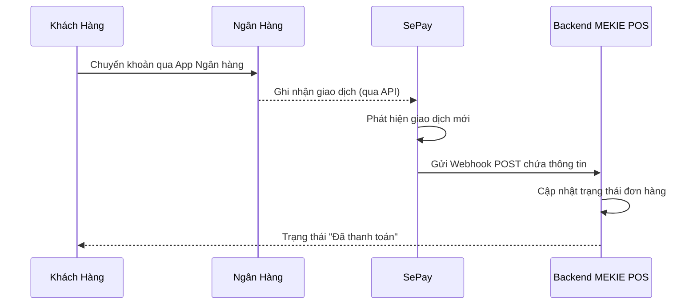
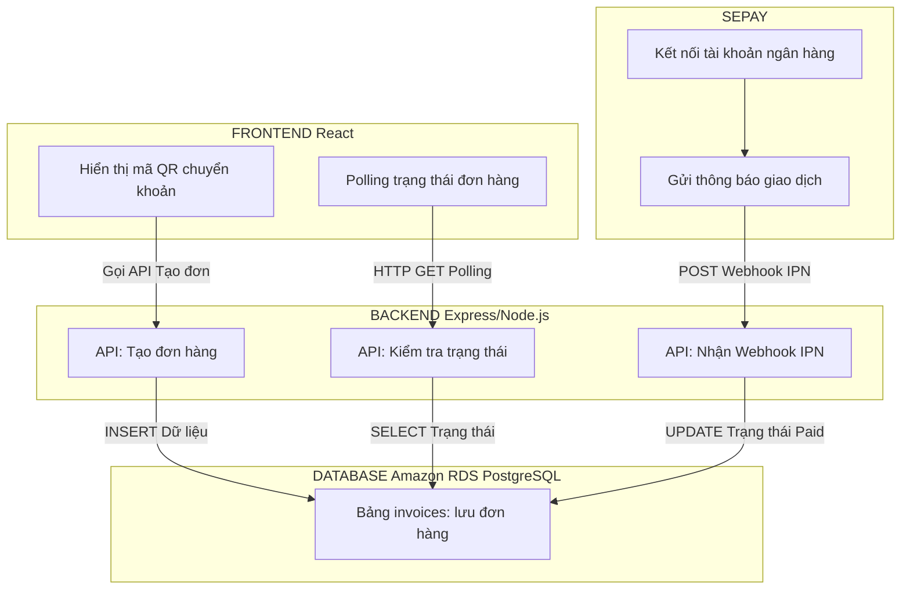
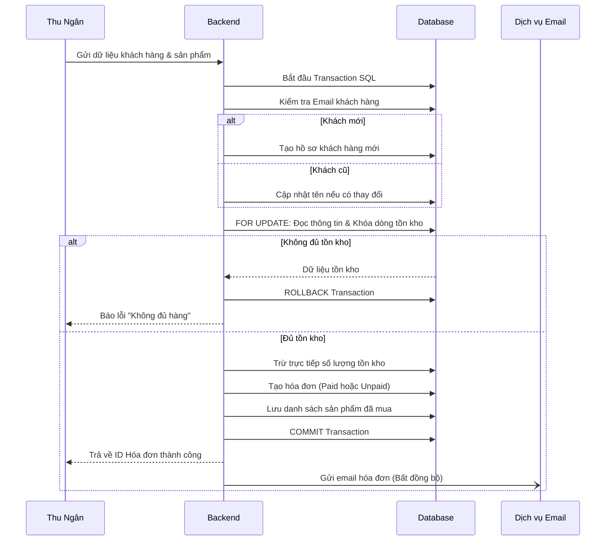
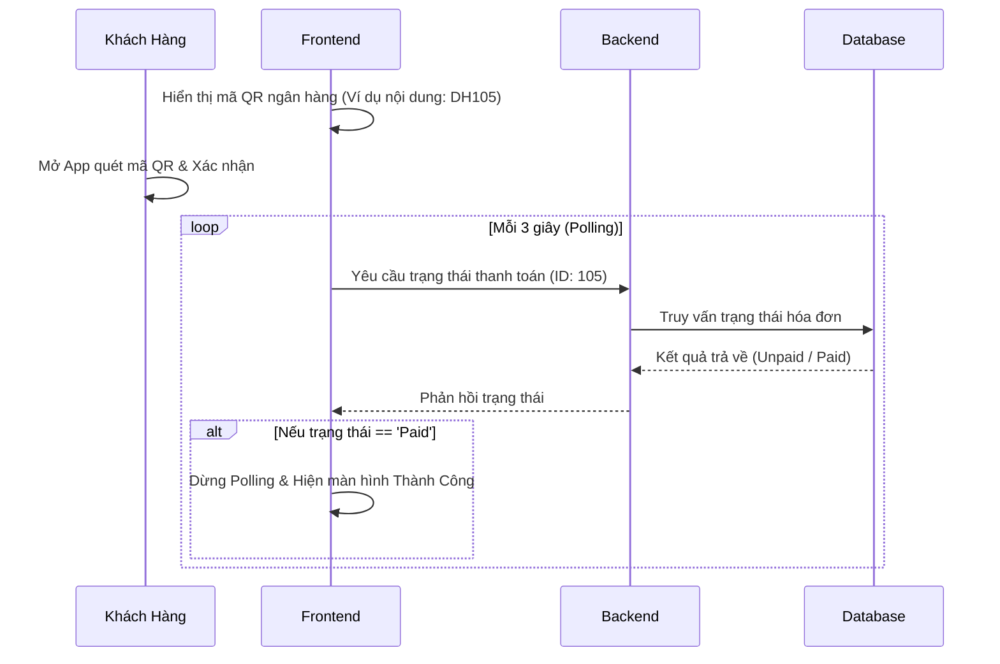
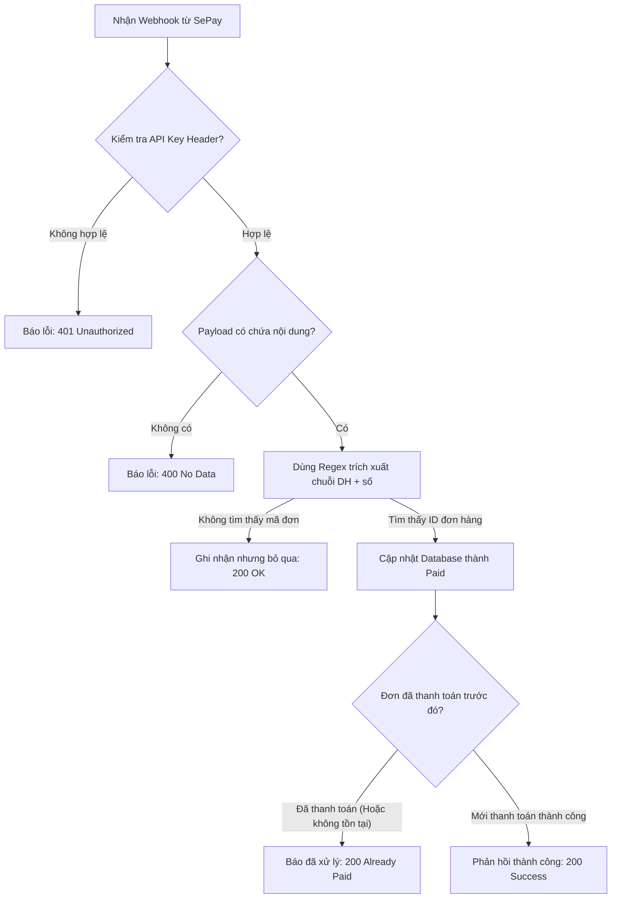

# CHƯƠNG 6. TÍCH HỢP PAYMENT GATEWAY (THÀNH DANH)

---

## 6.1. Tổng quan SePay

### 6.1.1. SePay là gì?

SePay là một nền tảng trung gian thanh toán (Payment Gateway) được phát triển tại Việt Nam, chuyên cung cấp giải pháp tích hợp thanh toán ngân hàng tự động cho các doanh nghiệp, ứng dụng thương mại điện tử và hệ thống POS. SePay hoạt động theo mô hình **IPN (Instant Payment Notification)** — khi khách hàng thực hiện chuyển khoản ngân hàng, SePay sẽ tự động phát hiện giao dịch và gửi thông báo đến hệ thống backend thông qua Webhook.

SePay hỗ trợ hầu hết các ngân hàng lớn tại Việt Nam như: Vietcombank, Techcombank, MB Bank, VPBank, BIDV, Agribank,... thông qua API kết nối tài khoản ngân hàng.

### 6.1.2. Lý do lựa chọn SePay

Trong dự án **MEKIE POS**, nhóm lựa chọn SePay vì những lý do sau:

| Tiêu chí | SePay | Lý do chọn |
|---|---|---|
| **Chi phí** | Miễn phí cho gói cơ bản | Phù hợp dự án học tập |
| **Tích hợp** | API đơn giản, có tài liệu rõ ràng | Dễ tích hợp với Node.js/Express |
| **Thị trường** | Hỗ trợ ngân hàng Việt Nam | Phù hợp với POS nội địa |
| **Cơ chế** | IPN Webhook real-time | Tự động cập nhật trạng thái đơn hàng |
| **Bảo mật** | API Key xác thực | Đơn giản, an toàn |

### 6.1.3. Mô hình hoạt động của SePay

SePay hoạt động theo luồng sau:

SePay đọc **nội dung chuyển khoản** (transfer description) để xác định đơn hàng nào cần cập nhật. Vì vậy, hệ thống phải quy ước một mã đơn hàng nhất quán trong nội dung chuyển khoản (ví dụ: `DH105` tương ứng với invoice ID = 105).

---

## 6.2. Kiến trúc tích hợp

### 6.2.1. Kiến trúc tổng thể

Hệ thống MEKIE POS tích hợp SePay theo mô hình **3 lớp**:

### 6.2.2. Tổ chức Backend & Bảo mật

Hệ thống được thiết kế với các quy tắc bảo mật sau:
- Thông tin cấu hình như `SEPAY_API_KEY` được lưu trữ an toàn trong các biến môi trường của máy chủ, đảm bảo mã nguồn mở không bị lộ khóa bí mật.
- Hệ thống định tuyến chia làm 2 nhóm rõ rệt:
  - **Nhóm bảo vệ (Protected):** Gồm các tính năng như tạo đơn hàng, yêu cầu người dùng (nhân viên/quản lý) phải đăng nhập và gửi kèm token (JWT).
  - **Nhóm công khai (Public):** Bao gồm API nhận Webhook từ SePay và API cho phép màn hình thanh toán kiểm tra trạng thái đơn hàng. API Webhook dùng phương thức xác thực bằng API Key riêng từ phía SePay, không dùng JWT người dùng.

---

## 6.3. Quy trình thanh toán

### 6.3.1. Tổng quan luồng thanh toán

Hệ thống hỗ trợ 2 phương thức thanh toán:

| Phương thức | Trạng thái ban đầu | Cập nhật trạng thái |
|---|---|---|
| `cash` | `Paid` (ngay lập tức) | Không cần cập nhật |
| `transfer` (chuyển khoản) | `Unpaid` | Webhook SePay cập nhật thành `Paid` |

### 6.3.2. Bước 1 - Tạo đơn hàng (Bảo vệ Race Condition)

Khi thu ngân gửi yêu cầu thanh toán, hệ thống thực hiện chuỗi các thao tác lưu trữ và kiểm tra an toàn theo sơ đồ sau:

**Chi tiết kỹ thuật:**
- Khách hàng được quản lý theo email, giúp hệ thống tạo nhanh nếu chưa có.
- **Bảo vệ Race Condition:** Việc lấy tồn kho sử dụng khóa dòng cấp cơ sở dữ liệu (`FOR UPDATE`) để ngăn ngừa trường hợp 2 đơn hàng đồng thời mua cùng 1 sản phẩm sắp hết hàng.
- Việc gửi email thông báo hóa đơn được thực hiện độc lập (bất đồng bộ) sau khi hệ thống đã lưu hóa đơn thành công vào cơ sở dữ liệu. Nhờ đó, nếu email lỗi, hóa đơn vẫn được tạo bình thường.

### 6.3.3. Bước 2 - Hiển thị QR và Polling

Sau khi tạo đơn thành công, hệ thống chuyển khoản yêu cầu khách hàng thanh toán và liên tục kiểm tra trạng thái:

Đây là cách phổ biến để frontend tự động làm mới giao diện ngay khi khách hàng thực hiện giao dịch, mang lại trải nghiệm thời gian thực.

---

## 6.4. Webhook xử lý giao dịch

### 6.4.1. Cơ chế Webhook IPN

Khi tiền về tài khoản, SePay gửi ngay một yêu cầu tới hệ thống MEKIE POS. Hệ thống được lập trình để nhận biết đơn hàng nào đã được thanh toán thông qua mã số được trích xuất từ mô tả giao dịch.

### 6.4.2. Trích xuất mã đơn hàng & Tính Bất Biến (Idempotency)

- **Trích xuất thông tin:** Hệ thống sử dụng Regex (biểu thức chính quy) để tìm kiếm các mã có định dạng nhất định (ví dụ `DH105`) nằm bất kỳ đâu trong toàn bộ nội dung lời nhắn chuyển khoản của khách hàng.
- **Tính Bất Biến (Idempotency):** Quá trình cập nhật trạng thái đơn hàng (từ `Unpaid` sang `Paid`) đi kèm với điều kiện kiểm tra chặt chẽ ngay trong câu lệnh cập nhật. Nhờ đó, dù Webhook có vô tình được SePay gửi lặp lại nhiều lần (do mạng chậm, lỗi đường truyền), hóa đơn cũng chỉ được cập nhật đúng 1 lần duy nhất, ngăn ngừa mọi sai sót dữ liệu.

---

## 6.5. Kiểm thử thanh toán

### 6.5.1. Chiến lược kiểm thử

Việc kiểm thử thanh toán bao gồm 3 cấp độ:

| Cấp độ | Phương pháp | Mục đích |
|---|---|---|
| **Unit Test** | Kiểm tra logic cục bộ | Đảm bảo Regex nhận dạng đúng mã đơn, xác thực API Key chính xác. |
| **Integration Test** | Giả lập Webhook gửi đến | Dùng các công cụ tạo request thủ công để gửi các payload đóng giả hệ thống SePay. |
| **End-to-End Test** | Chuyển khoản thực tế | Dùng ứng dụng ngân hàng thực hiện chuyển tiền có mã đơn hàng để nghiệm thu luồng. |

### 6.5.2. Các Kịch Bản Kiểm Thử (Test Cases)

Việc giả lập quá trình và các luồng lỗi được thực hiện nghiêm ngặt để đảm bảo an toàn.

| # | Kịch bản (Test Case) | Dữ liệu đầu vào giả lập | Kết quả mong đợi |
|---|---|---|---|
| 1 | **Webhook hợp lệ** | Gửi Webhook với API Key đúng và nội dung chứa mã đơn hợp lệ (VD: `DH105`). | Hệ thống nhận yêu cầu, cập nhật hóa đơn sang trạng thái `Paid` và phản hồi thành công. |
| 2 | **Sai API Key** | Gửi Webhook giả mạo với một khóa bí mật không khớp. | Hệ thống từ chối ngay lập tức với mã lỗi `401 Unauthorized`, không xử lý dữ liệu. |
| 3 | **Nội dung thiếu mã đơn** | Khách hàng chuyển khoản nhưng không điền đúng mã (VD: `"chuyen khoan tien"`). | Hệ thống bỏ qua giao dịch này một cách an toàn nhưng vẫn báo lại cho SePay để tránh gửi lặp lại. |
| 4 | **Webhook trùng lặp** | Gửi lại chính xác payload của một giao dịch đã thành công. | Hệ thống báo giao dịch đã được xử lý (Idempotency) và không cập nhật gì thêm. |
| 5 | **Thanh toán tiền mặt** | Thu ngân chọn phương thức tiền mặt trực tiếp. | Hóa đơn được tạo với trạng thái `Paid` lập tức, bỏ qua mọi quá trình Webhook. |
| 6 | **Race Condition** | Hai nhân viên cùng bán sản phẩm chỉ còn số lượng 1 trong cùng một lúc. | Hệ thống cho phép đơn đầu tiên thành công, đơn thứ hai bị từ chối do hết hàng. |
| 7 | **Đồng bộ giao diện** | Frontend hỏi trạng thái đơn vừa được thanh toán. | Nhận phản hồi `Paid` và tự động hiển thị giao diện báo thành công. |

---

*Chương 6 — Tích hợp Payment Gateway SePay vào hệ thống MEKIE POS*  
*Thực hiện: Thành Danh*
