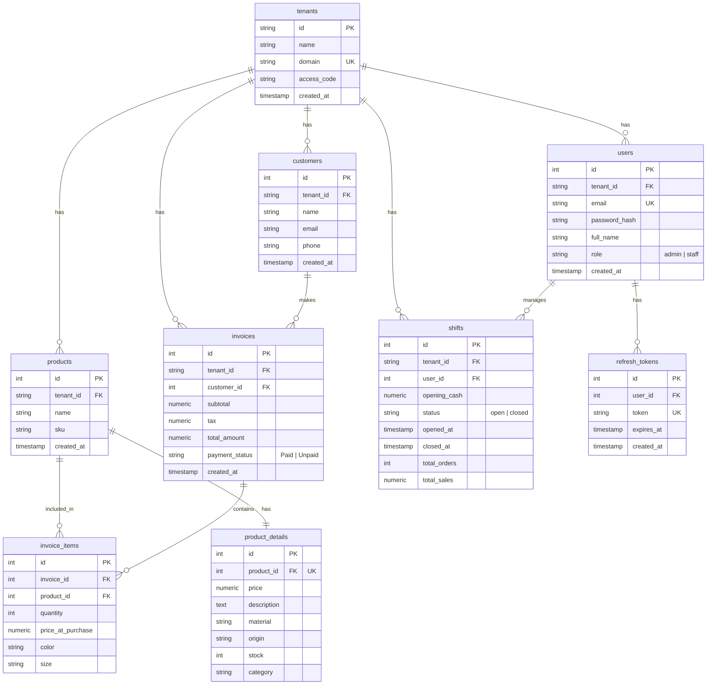

# Database Diagram (ERD)

Sơ đồ dưới đây mô tả cấu trúc cơ sở dữ liệu của hệ thống POS, sử dụng cú pháp **Mermaid**. Bạn có thể copy đoạn code này và dán trực tiếp vào **draw.io** (chọn `Arrange` > `Insert` > `Advanced` > `Mermaid`) hoặc xem trực tiếp trên GitHub/Markdown Viewer có hỗ trợ Mermaid.

